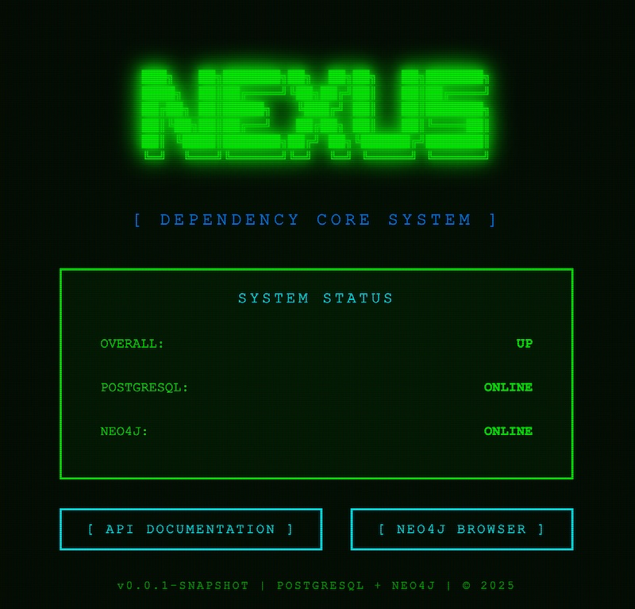

# Nexus - Dependency Management System

A graph-based dependency and resource management platform for tracking and analyzing entity relationships and dependencies in complex IT environments.



## Overview

Nexus provides a REST API for managing entities and their dependency relationships using a graph database backend. The system enables tracking dependencies between services, databases, APIs, and other IT resources with support for dependency graph traversal, bottleneck detection, and access control.

## Purpose

Track and visualize dependencies between IT resources to:
- Understand system architecture and relationships
- Identify bottlenecks and critical dependencies
- Analyze dependency chains and circular dependencies
- Control access to resources based on ownership and visibility
- Support impact analysis for changes and incidents

## Current Capabilities

### Entity Management
- Create, read, update, and delete entities (services, databases, APIs, etc.)
- Define custom entity types
- Assign ownership and access controls
- Store arbitrary properties as JSON
- Track creation and modification timestamps

### Dependency Relationships
- Define directed dependency relationships between entities
- Specify dependency criticality levels (LOW, MEDIUM, HIGH, BLOCKING)
- Categorize relationship types (database, api, service, etc.)
- Traverse dependency graphs with configurable depth
- Find all dependents of a given entity

### Graph Analysis
- Find dependencies of an entity (what it depends on)
- Find dependents of an entity (what depends on it)
- Identify bottlenecks (entities with most critical dependencies)
- Detect circular dependencies
- Calculate shortest paths between entities

### Access Control
- Three visibility levels: PUBLIC, DEPARTMENT, PRIVATE
- Owner-based access control
- Reader and writer permissions
- Department-level resource sharing
- Query accessible entities for specific users

## Technology Stack

### Backend
- **Language**: Kotlin 1.9.25
- **Framework**: Spring Boot 3.3.5
- **Build Tool**: Gradle 8.10.2 (Kotlin DSL)
- **JVM**: Java 21

### Databases
- **Graph Database**: Neo4j 5.x (entity instances and relationships)
- **Relational Database**: PostgreSQL 15.x (metadata and type definitions - configured but not yet implemented)
- **Test Database**: H2 (in-memory for integration tests)

### API
- REST endpoints using Spring MVC
- JSON request/response format
- Exception handling with problem details (RFC 7807)

## Project Structure

```
nexus/
├── src/
│   ├── main/
│   │   ├── kotlin/de/zilicon/nexus/
│   │   │   ├── NexusApplication.kt
│   │   │   ├── controller/          # REST API controllers
│   │   │   │   ├── AppInfoController.kt
│   │   │   │   ├── EntityController.kt
│   │   │   │   └── GraphController.kt
│   │   │   ├── domain/              # Domain models
│   │   │   │   └── graph/
│   │   │   │       ├── EntityNode.kt
│   │   │   │       ├── DependencyRelationship.kt
│   │   │   │       ├── Visibility.kt
│   │   │   │       └── Criticality.kt
│   │   │   ├── dto/                 # Data transfer objects
│   │   │   │   ├── EntityRequest.kt
│   │   │   │   └── EntityResponse.kt
│   │   │   ├── exception/           # Exception handling
│   │   │   │   └── GlobalExceptionHandler.kt
│   │   │   ├── repository/          # Data access
│   │   │   │   └── EntityRepository.kt
│   │   │   └── service/             # Business logic
│   │   │       ├── EntityService.kt
│   │   │       └── GraphService.kt
│   │   └── resources/
│   │       ├── application.yml
│   │       └── application-local.yml
│   └── test/
│       ├── kotlin/de/zilicon/nexus/
│       │   └── controller/          # Integration tests
│       │       ├── AppInfoControllerTest.kt
│       │       ├── EntityControllerTest.kt
│       │       └── GraphControllerTest.kt
│       └── resources/
│           └── application-test.yml
├── build.gradle.kts
├── settings.gradle.kts
└── docker-compose.yml
```

## Getting Started

### Prerequisites
- Java 21 or higher
- Docker and Docker Compose (for databases)
- Gradle 8.x (wrapper included)

### Running Locally

**Step 1: Start databases**
```bash
docker compose up -d
```

This starts:
- PostgreSQL on `localhost:5432` (configured but not yet used)
- Neo4j on `localhost:7474` (browser) and `localhost:7687` (bolt)

**Step 2: Start application**
```bash
./gradlew bootRun
```

Application runs on `localhost:8080`

**Stop services:**
```bash
# Stop application with Ctrl+C

# Stop databases
docker compose down
```

### Accessing Services

**Application API:**
```bash
curl http://localhost:8080/api/health
```

**Neo4j Browser:**
- URL: http://localhost:7474
- Username: `neo4j`
- Password: `password123`

### Running Tests

```bash
./gradlew test
```

All tests use H2 in-memory database for JPA and Neo4j for graph operations (19 tests, full coverage of CRUD and graph operations).

## API Endpoints

### Application Information
```
GET  /api/info     - Application metadata
GET  /api/health   - Health check
```

### Entity Management
```
POST   /api/entities              - Create entity
GET    /api/entities              - List all entities
GET    /api/entities/{id}         - Get entity by ID
PUT    /api/entities/{id}         - Update entity
DELETE /api/entities/{id}         - Delete entity
GET    /api/entities/type/{type}  - Find entities by type
GET    /api/entities/owner/{owner} - Find entities by owner
```

### Graph Operations
```
GET /api/graph/dependencies/{id}             - Find dependencies of entity
GET /api/graph/dependencies/{id}?depth=N     - Find dependencies with custom depth
GET /api/graph/dependents/{id}               - Find dependents of entity
GET /api/graph/bottlenecks                   - Find bottleneck entities
GET /api/graph/bottlenecks?limit=N           - Find top N bottlenecks
GET /api/graph/circular-dependencies         - Detect circular dependencies
GET /api/graph/shortest-path?sourceId=X&targetId=Y  - Find shortest path
GET /api/graph/accessible?userId=X&userDepartment=Y - Find accessible entities
```

## Data Models

### Entity
```kotlin
{
  "id": "generated-uuid",
  "type": "Service",
  "name": "API Gateway",
  "propertiesJson": "{}",
  "owner": "platform-team",
  "readers": ["dev-team", "ops-team"],
  "writers": ["platform-team"],
  "visibility": "DEPARTMENT",
  "createdAt": "2025-01-01T00:00:00Z",
  "updatedAt": "2025-01-01T00:00:00Z"
}
```

### Dependency Relationship
```kotlin
{
  "type": "database",
  "criticality": "HIGH",
  "target": { /* EntityNode */ }
}
```

### Enumerations
- **Visibility**: PUBLIC, DEPARTMENT, PRIVATE
- **Criticality**: LOW, MEDIUM, HIGH, BLOCKING

## Configuration

### Application Profiles

**Default (local development):**
- Uses `application.yml` and `application-local.yml`
- Neo4j connection to `bolt://localhost:7687`
- PostgreSQL connection to `localhost:5432`

**Test:**
- Uses `application-test.yml`
- H2 in-memory database for JPA
- Neo4j connection to `bolt://localhost:7687`

### Environment Variables

Configure databases using environment variables:
```bash
SPRING_NEO4J_URI=bolt://localhost:7687
SPRING_NEO4J_AUTHENTICATION_USERNAME=neo4j
SPRING_NEO4J_AUTHENTICATION_PASSWORD=password123

SPRING_DATASOURCE_URL=jdbc:postgresql://localhost:5432/nexus
SPRING_DATASOURCE_USERNAME=nexus
SPRING_DATASOURCE_PASSWORD=nexus123
```

## Development

### Build
```bash
./gradlew build
```

### Run
```bash
./gradlew bootRun
```

### Clean
```bash
./gradlew clean
```

### Test Coverage
```bash
./gradlew test jacocoTestReport
```

## Docker Management

### Start databases only:
```bash
docker compose up -d
```

### View logs:
```bash
docker compose logs -f
```

### Stop databases:
```bash
docker compose down
```

### Remove all data:
```bash
docker compose down -v
```

## Architecture Notes

### Dual Database Design

**Neo4j (Active):**
- Stores entity instances as graph nodes
- Manages DEPENDS_ON relationships
- Optimized for graph traversal queries
- Handles dependency analysis and path finding

**PostgreSQL (Configured):**
- Database connection configured
- Intended for entity type schemas and metadata
- Not yet implemented in current version
- Reserved for future structured data storage

### Design Decisions

See [DESIGN.md](DESIGN.md) for architectural decision records including:
- Choice of DEPENDS_ON relationship type over generic RELATED_TO
- Rationale for dual database architecture
- Graph query optimization strategies
